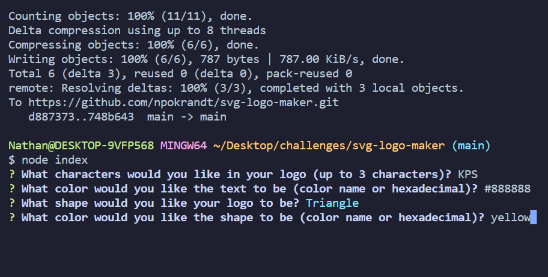

# svg-logo-maker
A script to generate SVG logos based off of user input

## Description

This is a simple CLI program that uses inquirer to build an SVG logo to be used for websites or any other purpose the user desires. It was built using Test-driven Development.

## Usage

The user initiates the program using 'node index.js' in the CLI. From there they will answer 4 questions: What text to go on the logo, up to 3 characters; what color the text should be; choose from a list of 3 shapes for what the logo should look like (circle, triangle, square); the background color for that shape. The questions will repeat if the user types an invalid color or more than 3 characters. Colors can be standard or hexadecimal. Once all prompts have been answered, the XML for the SVG file is generated and saved to the dist folder. From there the user can access the logo file and use it however they desire.

## Link

Watch a video demo here:
<!-- video when questions are finished -->

## Credits

Much of this code is patterned off of work we've done in class and a previous challenge. Aside from that it is my own

